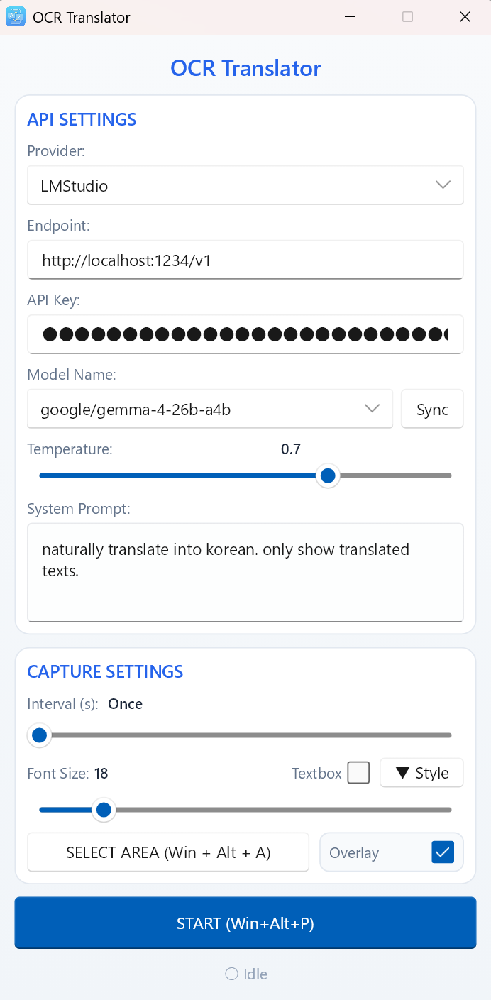

# Rust OCR Translator powered by VLM

A real-time screen OCR and translation tool built with Rust and Slint powered by VLM (Visual Language Model).

## Features
- **Modern UI**: Dark mode, glassmorphism, and Windows 11 Mica backdrop for the main control window.
- **Toggleable Overlay**: Dedicated toggle and logic to hide/show the translation box without stopping the OCR process.
- **Interactive Region Selection**: Drag your mouse to select exactly what you want to translate. Supports **Escape** to cancel.
- **Auto-Automation**: Selecting a region automatically starts the capture process for immediate results.
- **Change Detection**: Intelligent logic avoids redundant API calls by detecting screen changes.
- **Customizable Overlay**: Instantly change background color, text color, transparency, and separate textbox to match your preference.
- **Textbox mode & Click-Through**: Enable Textbox mode to hide the overlay's close button and allow **Click-Through Interaction**, letting you click applications behind the capture area while still seeing the translation boundary.
- **Dynamic scaling**: Font size automatically adjusts to fit the text within your selected area.
- **Clipboard Sync**: Translated text is automatically copied to the system clipboard for easy use elsewhere.
- **Multi-API Support**: 
  - **Google Gemini**: Supports gemini-3.1-pro-preview, gemini-3.1-flash-lite-preview, gemini-3-flash-preview, gemma-4-26b-a4b-it, gemma-4-31b-it (Auto-loads API key from `gemini.txt` in the app directory).
  - **LMStudio / Ollama**: Works with any OpenAI-compatible local AI endpoint. (Default: google/gemma-4-26b-a4b)
    - Recommended: gemma-4-26b-a4b (best balance), gemma-4-31b-it (best quality), qwen3.5-9b (fast)
- **External Config Files**:
  - `gemini.txt`: Auto-loads your Google Gemini API key.
  - `system_prompt.txt`: Auto-loads your custom translation instructions.
- **Adjustable Creativity**: Use the **Temperature** slider (0.0 - 1.0) to control translation consistency vs. creativity.
- **Global Hotkey**: Trigger area selection anytime with **Win + Alt + A**.

## Prerequisites
- **Rust**: [Install Rust](https://www.rust-lang.org/tools/install)
- **C++ Build Tools**: Required for `windows-rs` and `slint`.

## Getting Started
### 📥 Download
You can download the latest version from the [Releases Page](https://github.com/kirinonakar/ocr_trans/releases).
### Manual build

1. Clone the repository.
2. (Optional) Create `gemini.txt` (for API key) and `system_prompt.txt` (for custom instructions) next to the executable.
3. Run `cargo run --release`. Or `cargo build --release` to generate the binary.
4. Open the main window:
   - Select your provider (LMStudio or Google Gemini).
   - Click **SELECT AREA** and drag to select the region you want to translate (e.g. subtitles).
   - Capture starts automatically. Use the **STOP** button to pause, or **Win + Alt + A** to re-select the area.
   - Use the **Overlay** checkbox to hide/show the translation text while running.
   - Use the **Textbox** mode to move translations into a separate, draggable window.

### 🎨 Customization
- Click the **▼ Style** button next to Font Size to reveal customization options.
- **Background Color**: Choose from various presets including Dark, Light, and Paper-like themes. The selected color is highlighted.
- **Text Color**: Select a readable contrast for your chosen background.
- **Opacity**: Use the slider to adjust how much of the original screen shows through the overlay. Changes are reflected in real-time.
- **Dynamic Scaling**: The application automatically adjusts font size to fit the content within your chosen area.
- **Textbox Mode**: Optionally display translation results in a separate, resizable window while keeping the overlay active (at 10% opacity) for better focus. In this mode, the overlay's close button is hidden and **Click-Through Interaction** is enabled, allowing you to click on applications behind the capture area.

## Project Structure
- `src/main.rs`: Orchestration, event loop, and UI logic.
- `src/capture.rs`: Screen capture and change detection.
- `src/api.rs`: Multi-modal AI client (Gemini/OpenAI).
- `src/win_utils.rs`: Windows-specific UI hacks (layered windows, click-through, Mica).
- `ui/main.slint`: Modern UI definitions for Slint.

## License
This project is licensed under the MIT License - see the [LICENSE](LICENSE) file for details.
